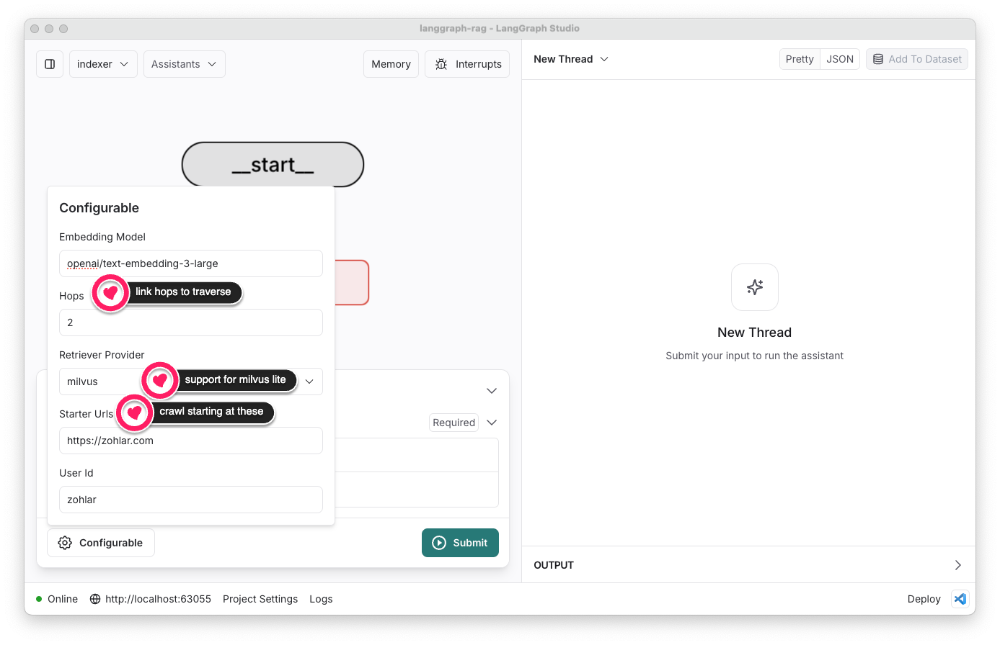
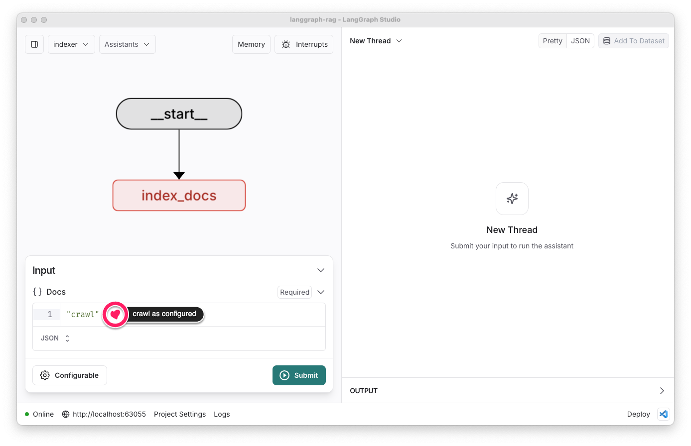

# Enhancements

Extend LangGraph's retrieval agent template:
1. **Crawl** from **starter_urls** list within a certain number of **hops** to build vector index
2. Add support for Milvus lite




## Create a new project using langGraph's retrieval agent template

Install the LangGraph CLI

```bash
pip install langgraph-cli --upgrade
```

Create a new app from a template
```bash
langgraph new
```


## Enhance the configurations

Add **starter_urls**, and **hops** to `IndexConfiguration` in [`configuration.py`](./src/retrieval_graph/configuration.py). Let's also add a method to get the list of urls from the comma-separated `starter_urls` string.

```python
    starter_urls: str = field(
        default="https://zohlar.com",
        metadata={
            "description": "Comma-separated string of starter URLs to crawl for indexing web pages."
        },
    )

    hops: int = field(
        default=2,
        metadata={
            "description": "Maximum number of hops to traverse pages linked to the starter URLs."
        },
    )

    def parse_starter_urls(self) -> list[str]:
        """Parse the starter URLs into a list.

        Returns:
            list[str]: A list of URLs parsed from the comma-separated string.
        """
        return [url.strip() for url in self.starter_urls.split(",") if url.strip()]
```

Let's also add `milvus` to `retriever_provider` list

```python
    retriever_provider: Annotated[
        Literal["elastic", "elastic-local", "pinecone", "mongodb", "milvus"],
        {"__template_metadata__": {"kind": "retriever"}},
    ] = field(
        default="milvus",
        metadata={
            "description": "The vector store provider to use for retrieval. Options are 'elastic', 'pinecone', 'mongodb', or, 'milvus'."
        },
    )
```


## Enhance to add Milvus (lite) retriever

### Dependencies

Let's begin by adding `langchain-milvus` as a dependency in [`pyproject.toml`](./pyproject.toml)

### Retriever

Let's add a new method to create a milvus retriever in [`retrieval.py`](./src/retrieval_graph/retrieval.py)

```python
@contextmanager
def make_milvus_retriever(
    configuration: IndexConfiguration, embedding_model: Embeddings
) -> Generator[VectorStoreRetriever, None, None]:
    """Configure this agent to use milvus lite file based uri to store the vector index."""
    from langchain_milvus.vectorstores import Milvus

    vstore = Milvus (
        embedding_function=embedding_model,
        collection_name=configuration.user_id,
        connection_args={"uri": os.environ["MILVUS_DB"]},
        auto_id=True
    )
    yield vstore.as_retriever()
```

and then use this in the factory method

```python
@contextmanager
def make_retriever(
    config: RunnableConfig,
) -> Generator[VectorStoreRetriever, None, None]:
    # ... same code as before

    match configuration.retriever_provider:
        # ... same code as before
        case "milvus":
            with make_milvus_retriever(configuration, embedding_model) as retriever:
                yield retriever

        case _:
            # ... as before
```

### .env

For milvus lite we'll use the following file uri to store the vector index:

```bash
## Milvus
MILVUS_DB=/deps/retrieval-agent-template/milvus.db
```

In the docker image the `retrieval-agent-template` repository is added at `/deps/retrieval-agent-template`. We'll place the milvus vector db file right there.

## Enhance index_graph

Out of the box implementation of `index_graph` (in [index_graph.py](./src/retrieval_graph/index_graph.py)) expects as input all the documents to be indexed. Since we are enhancing the graph to include an ingestion pipeline that crawls starting at the specified URL, we'll modify the `index_docs` node to kick start the crawl if docs list in the state is empty and `starter_urls` configuration has been provided.

```python
async def index_docs(
    state: IndexState, *, config: Optional[RunnableConfig] = None
) -> dict[str, str]:
    # ... as before
    with retrieval.make_retriever(config) as retriever:
        # code to kick start crawl if required
        configuration = IndexConfiguration.from_runnable_config(config)
        if not state.docs and configuration.starter_urls:
            print(f"starting crawl ...")
            state.docs = await crawl (
                configuration.user_id,
                configuration.parse_starter_urls(),
                configuration.hops
            )
        # rest remains the same as before
        stamped_docs = ensure_docs_have_user_id(state.docs, config)
        if configuration.retriever_provider == "milvus":
            retriever.add_documents(stamped_docs)
        else:
            await retriever.aadd_documents(stamped_docs)
    return {"docs": "delete"}
```

Add the following functions that wrap around the new [`Crawler component`](./src/retrieval_graph/index_graph.py)
```python
async def crawl(tenant: str, starter_urls: list, hops: int):
    allowed_domains = set(urlparse(url).netloc for url in starter_urls)
    crawler = WebCrawler(starter_urls, hops, allowed_domains, tenant)
    await crawler.crawl()
    return [
        Document(page_content=get_file_content(page["local_filepath"]), metadata={"url": page["url"]})
        for page in crawler.crawled_pages
    ]

def get_file_content(file_path: str) -> str:
    with open(file_path, 'r', encoding='utf-8') as file:
        return file.read()
```

### Dependencies

The [`Crawler component`](./src/retrieval_graph/index_graph.py) uses [`playwright`](https://playwright.dev/python/), which uses headless browsers. Let's add `playwright` & `requests` as dependencies in [`pyproject.toml`](./pyproject.toml).

Just adding `playwright` package to the python environment is not sufficient. The headless browser along with their dependencies also need to be installed. So we need to run `playright install`, and `playwright install-deps` as well. Since this needs to happen in the docker. We'll add the following to [`langgraph.json`](./langgraph.json)

```json
"dockerfile_lines": ["RUN pip install playwright", "RUN python -m playwright install", "RUN python -m playwright install-deps"],
```

### Index State

The `index_docs` node (in [index_graph.py](./src/retrieval_graph/index_graph.py)) takes `IndexState` (in [state.py](./src/retrieval_graph/state.py)) as input. Let's add the following logic in the reducer function (`reduce_docs`) to empower the user to ask for crawl.

```python
def reduce_docs(
    existing: Optional[Sequence[Document]],
    new: Union[
        Sequence[Document],
        Sequence[dict[str, Any]],
        Sequence[str],
        str,
        Literal["delete"],
    ],
) -> Sequence[Document]:
    if new == "crawl"
        return []
    # rest if as before
```

With this enhancement, the user may just set `docs` to `"crawl"` as follows:


Here's a usage video of enhanced retrieval template!


https://github.com/user-attachments/assets/88839a0d-5582-4548-80a3-fd877d344471


